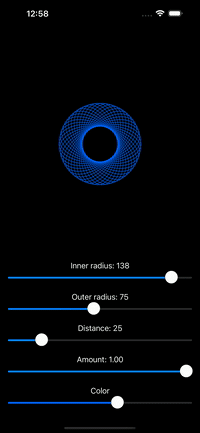

# Spirograph
 Draw a spirograph!  
 More info: [Wikipedia](https://en.wikipedia.org/wiki/Spirograph
 
# Installation
 1. Open up Xcode
 2. Click on File > Open
 3. Select Drawing.xcodeproj
 4. Press Command+R to Build and Run
